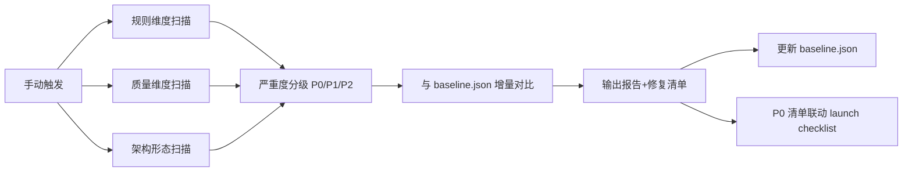

## 产品概述
一个手动触发的「架构巡检」skill，把《代码整洁之道》的 relentless refactoring 工程化：巡检只负责发现偏离，改造始终小步进行。触发时对项目执行三维度巡检（项目规则 / 代码质量 / 架构形态），对照规则基线输出带严重度分级的报告与修复清单。

## 核心特性
- 手动触发：说「架构巡检」「架构体检」「architecture check/inspection」时执行，无定时自动化
- 三维度巡检：
  - 规则维度：对照 .codebuddy/rules/ 五份规则（WXT 结构、分发政策、i18n、测试门禁契约、命令约定）
  - 质量维度：strict TS 无 any、死代码/僵尸文件、依赖健康（bun.lock、无 npm/yarn lock）、硬编码文案
  - 架构形态维度：入口文件膨胀度、background 最小化、popup/content 职责划分、模块引用方向
- 严重度分级：P0（发布阻断）/ P1（应尽快修）/ P2（建议改进）
- 门禁联动：P0 偏离作为发布前必查项，供 extension_launch_checklist 引用
- 基线对比：首次巡检生成 baseline，后续增量 diff——重复项不刷屏、新增偏离立即暴露、已修复项自动关闭
- 修复驱动：报告末尾输出修复清单，每项附小步重构建议（独立提交、过测试门禁）


## 技术栈
- Skill 载体：Markdown 指令式 SKILL.md，沿用 extension_launch_checklist 的 frontmatter + 分步指令格式
- 检查手段：静态扫描（Read / Grep / Glob / Bash），零运行时依赖，秒级完成
- 基线存档：JSON 文件（.codebuddy/skills/architecture-inspection/baseline.json，受版本库管理）

## 实现方法
### 执行流程
手动触发 → 三维度扫描（规则 / 质量 / 架构形态）→ 严重度分级 → 与 baseline 增量对比 → 输出报告 + 修复清单 → 更新 baseline

### 关键设计
- 基线机制：baseline.json 记录已知偏离的 {id, dimension, severity, status} 与修复状态；后续巡检按 id 对比——已存在项标记「已知」不重复刷屏、新增项高亮「新增」、状态已修复的标记「已关闭」
- 严重度映射：P0 = 发布阻断项（远程代码执行、MV2 残留、非法 i18n key、CDN JS 加载、host_permissions 过宽）→ 联动 extension_launch_checklist 门禁；P1 = 应尽快修（strict any、僵尸文件、锁文件混入）；P2 = 建议改进（膨胀度、职责划分）
- 阈值校准：入口文件膨胀度（如 >400 行）等阈值由真实扫描校准，避免误报
- 置信度标注：静态可确证项标【事实】，推断项标【推测】，与现有 skill 一致

## 执行要点
- 巡检只负责发现，不负责集中改造；修复清单每项独立提交并过 tests/ 门禁
- baseline.json 变更随代码入库，保证跨设备一致
- 不新建 automation（用户已确认仅手动触发）

## 架构设计


## 目录结构
```
.codebuddy/skills/
├── architecture-inspection/          # [NEW] 架构巡检 skill
│   ├── SKILL.md                      # [NEW] 技能主文件：frontmatter（触发词+allowed-tools）、执行总览、三维度巡检分 Step 指令、严重度分级、报告格式、基线对比规则、修复清单驱动
│   └── baseline.json                 # [NEW] 基线存档模板（空示例结构），首次巡检生成实例
└── extension_launch_checklist/
    └── SKILL.md                      # [MODIFY] Step 1 静态基线核查增加 P0 门禁入口：优先引用 architecture-inspection 的 P0 偏离清单
```

## 关键数据结构
baseline.json 的 schema（SKILL.md 读写的契约）：
```json
{
  "version": 1,
  "lastRunAt": "ISO8601",
  "findings": [
    {
      "id": "wxt-eval-001",
      "dimension": "rule|quality|architecture",
      "severity": "P0|P1|P2",
      "location": "entrypoints/background.ts:12",
      "description": "eval 使用",
      "status": "open|fixed|acknowledged",
      "firstSeenAt": "ISO8601",
      "resolvedAt": null
    }
  ]
}
```


## Agent Extensions
### Skill
- **skill-creator**
  - Purpose: 在编写 SKILL.md 前加载，遵循其 skill 创建规范（frontmatter 格式、description 触发词编写、工作流指令结构），确保产物符合 CodeBuddy skill 标准
  - Expected outcome: SKILL.md 结构与现有 extension_launch_checklist 一致且可被正确触发
### SubAgent
- **code-explorer**
  - Purpose: 对真实代码库执行巡检扫描验证，确认 SKILL.md 中每个检查项的 grep/glob 模式可命中真实代码、阈值（如入口文件行数）合理
  - Expected outcome: 校准后的阈值与检查模式，避免首次巡检大面积误报
