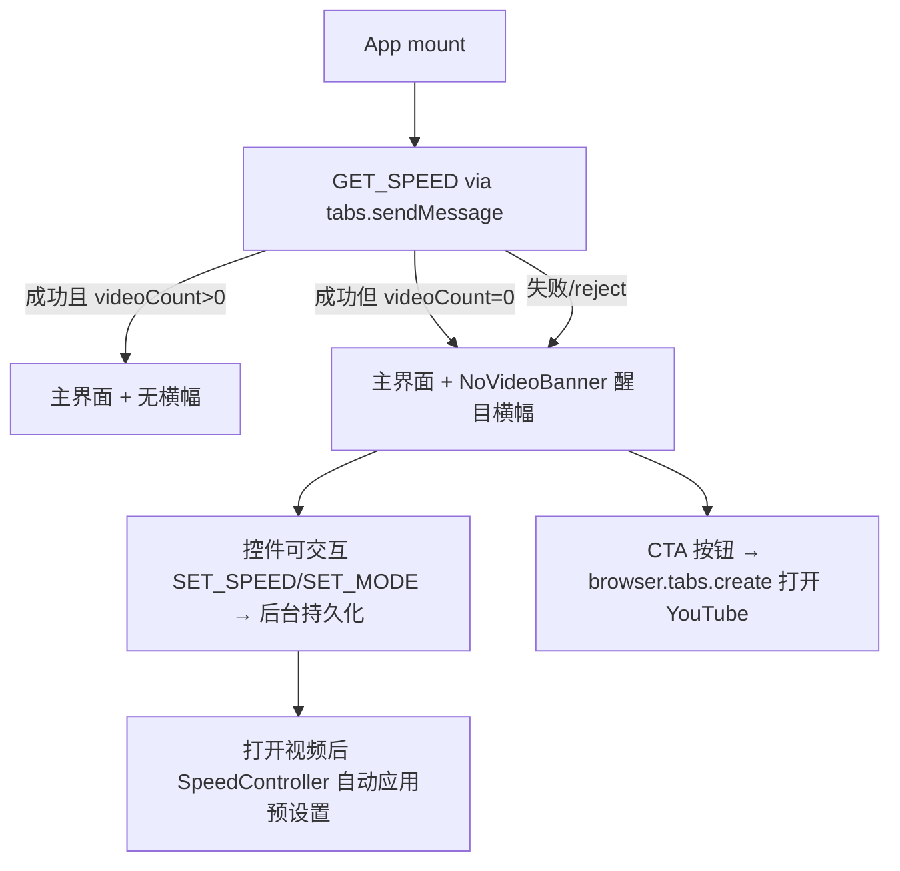

## 产品概述
解决安装用户因 popup 无视频时显示空白页、未能看到产品核心功能而流失的问题。改造后：即使当前页面未检测到视频，popup 也始终展示完整的功能界面，并将"未检测到视频"提示改为醒目横幅（带引导按钮），把无视频场景转化为产品体验入口。

## 核心功能
- 无视频时不再显示空白页，popup 始终渲染完整功能界面（速度徽章、站点切换、滑杆、预设、自定义输入、评分入口）
- 未检测到视频时，界面顶部展示醒目提示横幅：图标 + "未检测到视频" + 引导文案 + "去 YouTube 试试"跳转按钮（`browser.tabs.create` 打开新标签页）
- 无视频时速度控件保持可交互：用户可提前设定倍速并保存（当前站/全部站），打开视频后自动生效（后台已支持预设置持久化，无需改动 content script）
- 无视频时隐藏 header 中矛盾的 "0 videos detected" 副标题，状态信息统一由横幅承担
- 检测到视频后横幅自动消失，恢复原有"检测到 N 个视频"文案


## 技术栈
- 沿用现有技术栈，零新增依赖：WXT + React 19 + TS strict + Tailwind CSS v4（`@tailwindcss/vite`）
- 构建/验证：仅 bun（`bun run generate:i18n`、`bun run compile`、`bun run build`）

## 实现思路
**方案**：删除 `App.tsx` 中 `loadState === 'no-video'` 的早退分支，使主界面成为唯一渲染路径；用 `videoCount === 0` 条件驱动顶部横幅显隐。速度状态（speed/speedMode/domain）与现有主界面状态完全复用，控件照常调用 `SET_SPEED`/`SET_MODE`。

**可行性依据（已勘察）**：
- `entrypoints/content.ts` 的 `SET_SPEED` 无条件执行 `persistSpeed`（按模式写入 storage）、`SET_MODE` 无条件写模式并解析速度；`SpeedController.trackVideo` 在视频出现时自动应用当前倍速——预设置功能后台已完整支持，content script 与 speed-controller 均无需改动
- 引导按钮复用 `browser.tabs.create` 模式（同 `RatingButton`），新增示例站点 URL 常量

**健壮性**：`sendMessage` 对无 content script 注入的页面（如 chrome://、商店页）会 reject；改造后无视频态控件可交互，需为 fire-and-forget 的 `SET_SPEED`/`SET_MODE` 调用补 `.catch(() => undefined)`，避免未处理的 Promise 拒绝（当前 NoVideoView 无控件，不存在此问题，改造后必须补上）。

**性能**：改动仅涉及 popup 渲染层，无新增监听器/轮询/存储读写，无性能影响。

## 执行要点
- i18n：新增 key（如 `noVideoCta`）必须覆盖 16 个 locale（ar/da/de/en/es/fr/hi/it/ja/ko/nl/no/pt_PT/sv/zh_CN/zh_TW），改 `translations/messages.ts` 后必须运行 `bun run generate:i18n` 再构建（prebuild 已挂载）；`public/_locales/**` 禁止手改
- 复用现有 `noVideo`、`noVideoHint` 文案（无需重复翻译），仅新增按钮文案 key
- 删除 `NoVideoView.tsx` 及其导入，避免死代码
- 同步更新 `docs/ui-baseline.md`（组件清单 + 横幅规范），保持视觉事实源一致
- 颜色必须用 `brand-*`/`var(--color-brand-*)`，禁止硬编码 hex 与 sky-*/cyan-*（ui-baseline.md 已声明实际基线为 brand 体系）

## 架构设计
改造后 popup 渲染流程：



- `LoadingState` 保留 `loading | loaded | no-video`，但 `no-video` 不再早退，仅作为横幅显示条件
- 新增 `NoVideoBanner` 组件，位置：header 之下、ModeToggle 之上

## 目录结构
```
project-root/
├── entrypoints/
│   └── popup/
│       ├── App.tsx                        # [MODIFY] 移除 no-video 早退分支；videoCount===0 时条件渲染横幅、隐藏矛盾副标题；为 SET_SPEED/SET_MODE 调用补 .catch
│       └── components/
│           ├── NoVideoBanner.tsx          # [NEW] 无视频醒目横幅：品牌渐变底 + 图标 + noVideo/noVideoHint 文案 + 「去 YouTube 试试」CTA 按钮（browser.tabs.create 打开示例站点）
│           └── NoVideoView.tsx            # [DELETE] 空白页组件，改造后无使用方，删除并移除 App.tsx 导入
├── translations/
│   └── messages.ts                        # [MODIFY] 新增 noVideoCta 按钮文案 key（16 locale）
├── docs/
│   └── ui-baseline.md                     # [MODIFY] 组件清单移除 NoVideoView、新增 NoVideoBanner 及横幅视觉规范
└── public/_locales/**                     # [AUTO] bun run generate:i18n 自动生成，禁止手改
```


## 设计说明
沿用 `docs/ui-baseline.md` 既定基线（brand 色系、系统字体栈、360px 固定宽、rounded-xl 卡片、slate 中性色），在 popup 顶部新增一块醒目横幅，作为无视频场景的状态提示与体验入口。

### 页面布局（自上而下）
1. **Header**：保持不变（Speeding 标题 + 视频计数副标题 + 68px 速度徽章）；无视频时隐藏副标题行，避免 "0 videos detected" 矛盾文案
2. **NoVideoBanner（新增）**：位于 header 之下、ModeToggle 之上，全宽 `rounded-lg` 品牌渐变底（`bg-gradient-to-r from-brand-500 to-brand-600`，白字），内部分三行：图标（白色视频/提示图标）+ 主文案 "No video detected"（`text-body font-semibold`）、引导提示语（复用 noVideoHint，白色 80% 透明度 `text-hint`）、白色胶囊按钮 "Try on YouTube"（白底品牌字，hover 微缩放 `active:scale-[0.97]`）——高对比、第一眼可识别
3. **功能区**：ModeToggle / SpeedSlider / PresetGrid / CustomInput 保持原样，无视频时可交互
4. **底部**：RatingButton + shortcutHint 保持原样

### 视觉要点
- 横幅以品牌高饱和渐变制造"醒目"焦点，与下方白色功能卡形成层级对比；图标用白色线条风格（strokeWidth 1.5）呼应现有图标语言
- 按钮 hover 态：`hover:bg-white/95`、`focus-visible:ring-2 ring-white/40`，保持动效统一 `duration-150`
- 横幅出现/消失不做复杂动画，仅由 React 条件渲染切换，避免 popup 打开时的闪烁感知
- 保持所有颜色来自 brand 色阶与 slate 中性色，不引入新色相

## 风格关键词
品牌渐变、高对比横幅、简洁卡片、圆角、微交互
