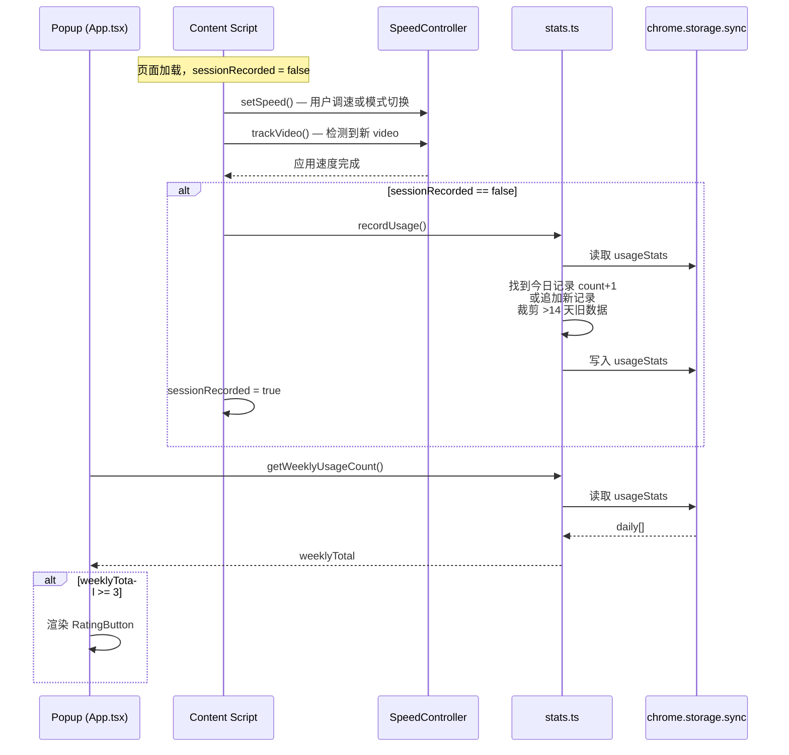

## 产品概述
在 Speeding 扩展 popup 主界面底部，添加"去应用商店评价"引导按钮。按钮仅对一周内使用变速效果 >= 3 次的活跃用户展示，避免过度打扰。为此配套开发一套隐私安全、可扩展的用户行为统计模块。

## 核心功能
- **变速使用统计**：在 content script 端，每次 SET_SPEED / SET_MODE 重应用 / trackVideo 自动应用速度时，按页面会话去重计数一次（同一页面多次变速只计 1 次），数据存入 `chrome.storage.sync`
- **重要用户识别**：计算当周（周一至周日）累计使用次数，>= 3 判定为活跃用户
- **评分按钮**：popup 底部展示，含星标图标和引导文案，点击跳转 Chrome Web Store 或 Edge Add-ons 商店页面
- **浏览器自动识别**：运行时通过 UA 检测 Edge，自动选择对应商店链接
- **可扩展架构**：统计模块以独立工具文件形式存在，暴露通用 API 供后续添加其他行为指标
- **隐私安全**：仅存储日期+计数（`{"date":"2026-08-10","count":1}`），无用户标识、无网络传输，数据保留 14 天自动清理


## 技术选型
- **语言/框架**：TypeScript + React 19 + WXT（沿用现有技术栈）
- **样式**：Tailwind CSS v4（与现有 popup sky-gradient 风格一致）
- **存储**：`chrome.storage.sync`（键名 `usageStats`），利用浏览器自身同步能力跨设备，数据始终在用户/Google/Microsoft 平台内
- **浏览器检测**：`navigator.userAgent.includes("Edg/")` 运行时判定

## 实现方案

### 架构决策

**为什么计数放在 content script 而不是 popup**：用户可能一周内都不打开 popup，但每天打开视频网站时 content script 自动应用已保存速度——这也算"使用了变速效果"。放在 content script 端才能覆盖"不必重开 popup"的场景。

**为什么按页面会话去重**：`trackVideo` 在 SPA 页面可能被 MutationObserver 多次触发，`SET_SPEED` 也可能连续拖动。若不作去重，单页面就能刷出几十次计数。用 `let sessionRecorded = false` 模块级标志，每个页面负载只计 1 次，简单可靠。

**为什么用 `chrome.storage.sync` 而非 `local`**：用户需求明确要跨设备同步。sync 存储的用量限制为 100KB，当前每日一条记录 ~40 字节，14 天仅 ~560 字节，远在限额内。且 sync 天然具备配额异常的 fallback 需求——沿用 storage.ts 已有的 sync→local 双写模式即可。

### 数据流



### 模块职责

| 模块 | 文件 | 职责 |
|------|------|------|
| 常量定义 | `entrypoints/utils/constants.ts` | `isEdge()` 浏览器检测、`EXTENSION_ID` 占位符、`getStoreUrl()` |
| 统计模块 | `entrypoints/utils/stats.ts` | `recordUsage()`、`getWeeklyUsageCount()`、`isQualifiedUser()`、数据裁剪 |
| 评分组件 | `entrypoints/popup/RatingButton.tsx` | 打开即检查资格、渲染按钮、点击跳转商店 |
| Content Script | `entrypoints/content.ts` | 在 SET_SPEED/SET_MODE/trackVideo 路径调用 `recordUsage()`（含去重） |
| Popup 集成 | `entrypoints/popup/App.tsx` | 在 Custom 区域下方插入 `<RatingButton />` |

### 去重机制详解

在 `content.ts` 模块顶层声明 `let sessionRecorded = false;`。三个触发点（SET_SPEED 行 31、SET_MODE 行 50、trackVideo 行 75）在各自逻辑执行后，统一检查 `if (!sessionRecorded) { recordUsage(); sessionRecorded = true; }`。页面刷新后 JS 上下文重建，标志自动重置。无需持久化标志，无需定时器，零额外开销。

### 性能考量
- **存储读写**：每次记录读取一次 sync（14 条记录 → < 1ms），O(n) 查找今日记录，O(n) 裁剪过期数据。n ≤ 14，无性能瓶颈
- **Popup 检查**：每次 popup 打开读取一次 sync，异步不阻塞 UI 渲染
- **去重开销**：一次布尔判断，可忽略

## 实现细节

### 文件变更清单

```
d:/code/speeding/
├── entrypoints/
│   ├── popup/
│   │   ├── App.tsx              # [MODIFY] 第 383 行后插入 <RatingButton />
│   │   └── RatingButton.tsx     # [NEW] 评分按钮组件
│   ├── content.ts               # [MODIFY] SET_SPEED/SET_MODE/trackVideo 触发后调用 recordUsage()（带去重）
│   └── utils/
│       ├── constants.ts          # [NEW] isEdge / EXTENSION_ID / getStoreUrl
│       └── stats.ts              # [NEW] recordUsage / getWeeklyUsageCount / isQualifiedUser
```

### 关键类型定义

```typescript
// stats.ts
interface DailyUsage {
  date: string;   // "YYYY-MM-DD"
  count: number;  // 当日变速使用次数
}

interface UsageData {
  daily: DailyUsage[];
}
```

### stats.ts 接口

- `recordUsage(): Promise<void>` — 读取 usageStats → 今日 count+1（或追加）→ 裁剪 14 天旧数据 → 写入 sync
- `getWeeklyUsageCount(): Promise<number>` — 读取 → 筛选当前周 → 累加 count
- `isQualifiedUser(): Promise<boolean>` — `getWeeklyUsageCount() >= 3`

按 storage.ts 已有模式实现读写，保持风格一致。

### content.ts 修改要点

```typescript
// 模块顶层
let sessionRecorded = false;

// SET_SPEED handler（行 31 之后）
controller.setSpeed(msg.speed);
// ... storage persist ...
if (!sessionRecorded) { recordUsage(); sessionRecorded = true; }

// SET_MODE handler（行 50 之后）
controller.setSpeed(resolved);
if (!sessionRecorded) { recordUsage(); sessionRecorded = true; }

// trackVideo 内的 apply()（speed-controller.ts 行 75）
// 方案：在 speed-controller.ts 中新增一个回调钩子 onFirstApply?，
// 由 content.ts 注入，首次 apply 时调用回调并自毁
```

### speed-controller.ts 修改要点

在 `trackVideo()` 方法中，区分"首次为页面中的 video 应用速度"和"后续重新应用"。具体做法：增加可选的 `onFirstApply` 回调属性，构造时由 content.ts 注入；在 `apply()` 中，若回调存在则调用一次后置 null。此方案不改动 setSpeed/getSpeed 等公共接口，向后兼容。

### RatingButton.tsx 组件

- `useEffect` 调用 `isQualifiedUser()`，结果控制 `useState<boolean>`
- 符合条件时渲染居中按钮：星标 SVG 图标 + "去应用商店评价"文字
- 点击调用 `browser.tabs.create({ url: getStoreUrl() })`
- 按钮样式：`bg-white/80 border border-slate-200 hover:bg-sky-50` 轻量处理，不抢占视觉焦点
- 不符合条件时返回 `null`（不占空间）


## Agent Extensions

### Skill
- **extension_launch_checklist**
  - 用途：实现完成后运行 MV3 合规自检，检查新增 storage.sync 使用是否影响商店审核（权限声明、隐私政策一致性）
  - 预期结果：输出合规报告，确认 `usageStats` 的 sync 存储与隐私政策中"no analytics"声明的兼容性
