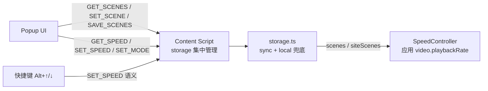

## 用户需求
为 Speeding 扩展新增「按场景预设播放速度」的差异化特性：刷课程拿积分 16×、追剧 1.25×、外语听力 0.75×，用于切入市场、强化 Auto-speed（set-and-forget）定位。

## 产品概述
在现有 This site / All sites 两个模式之间新增第三个模式标签「Scenes（场景）」：点击展开场景列表，选择场景即一键应用该场景倍速并绑定当前站点，下次访问自动恢复。内置三个常见场景并预置主流网站的场景类型（形式与用户自定义场景完全一致，同一数据结构、同一编辑界面），用户可增删改场景的名称与倍速值。

## 核心功能
- 三态模式切换：This site / Scenes / All sites（Scenes 居中）
- 场景列表展示与管理：增、删、改场景名称与倍速值（范围 0.5×–16×，clamp 处理），行内编辑表单
- 场景应用与站点记忆：点击场景 → 应用该倍速并写入当前站点绑定；下次打开该站点自动恢复场景倍速
- 预置默认数据：全新安装首次初始化时写入内置场景（刷课程 16× / 追剧 1.25× / 外语听力 0.75×）+ 主流网站（Udemy、Coursera、Bilibili、Netflix、YouTube 等）的默认场景绑定，用户可随时覆盖
- 冲突规避：用户手动调整速度（滑杆/预设/自定义/快捷键）时自动退出 Scenes 模式回 This site 并持久化，避免场景速度覆盖用户手动设置
- 场景数据随账号跨设备同步（chrome.storage.sync + local 兜底）


## 技术栈
沿用现有技术栈：WXT + React 19 + TypeScript strict + Tailwind CSS v4 + browser.* 命名空间，Bun 包管理，MV3（Chrome 优先、Firefox 兼容），i18n 16 语言。无新增依赖。

## 架构设计

### 数据模型
```ts
type SpeedMode = 'this' | 'scenes' | 'all';
type Scene = { id: string; name: string; speed: number; builtin?: boolean };
```
- `builtin=true` 时 `name` 存 i18n key（如 `sceneCourse`），渲染经 `browser.i18n.getMessage` 解析；用户改名后置 `builtin=false` 存自由文本
- 内置场景固定 id：`course`(16×)、`series`(1.25×)、`listening`(0.75×)；自定义场景 id 用 `scene-${crypto.randomUUID()}`
- 存储新增 key：`scenes`（Scene[] 全量）、`siteScenes`（Record&lt;hostname, sceneId&gt;）；`SpeedMode` 由 `'this'|'all'` 扩为三态（旧值兼容）

### 预置默认数据（仅全新安装触发）
storage 首次读取 `scenes` 为空时，初始化写入内置场景 + 主流网站默认绑定表（如 udemy.com/coursera.org/bilibili.com→course、netflix.com/disneyplus.com/iqiyi.com→series、youtube.com/ted.com→listening）。老用户升级不受影响：默认 mode 仍为 `this`，预置绑定仅在用户切到 Scenes 模式后生效，无破坏性。

### 消息协议扩展（沿用 popup ↔ content script 模式，background 保持最小）
| 消息 | 方向 | Payload | 响应 |
|---|---|---|---|
| `GET_SCENES` | Popup→CS | `{}` | `{ scenes, siteSceneId }` |
| `SET_SCENE` | Popup→CS | `{ sceneId: string \| null }` | `{ success, speed }`（null=解绑回 1×） |
| `SAVE_SCENES` | Popup→CS | `{ scenes }` | `{ success }`（增删改后全量覆盖，并清理 `siteScenes` 悬空引用） |
| `GET_SPEED` | Popup→CS | `{}` | 原字段 + `sceneId: string \| null` |
| `SET_SPEED` | Popup→CS | `{ speed }` | 原字段 + `speedMode`（供 popup 同步自动退出场景态） |

### 生效逻辑
- `getResolvedSpeed(hostname)` 扩展：`mode==='scenes'` → `siteScenes[hostname]` 对应 scene.speed，无绑定或场景已删除 → 1（默认）
- `SET_SCENE`：写 `siteScenes[hostname]=sceneId` → 应用场景速度 → 返回；再次点击已绑定场景 → 解绑（null）回 1×
- `SET_SPEED` / 快捷键：若 `currentMode==='scenes'`，先写 `speedMode='this'` 再写 `siteSpeeds[hostname]`，响应携带新 mode 供 popup 同步

### 数据流

沿用现有「content script 集中管理 storage、popup 保持轻量」架构，不引入新模式。

### 性能与可靠性
- storage 读写仅在用户交互时触发（打开 popup、切模式、点场景、增删改），非高频路径；`SAVE_SCENES` 全量写入量级极小（场景数 ≤ 数十），无性能问题
- 删除场景时在 `SAVE_SCENES` 内统一清理 `siteScenes` 悬空 id，resolve 层再做兜底（场景缺失 → 默认 1×），双保险
- 向后兼容：旧 `speedMode` 值（'this'/'all'）与旧存储结构不受影响；新消息为增量扩展

## 目录结构
```
d:/code/speeding/
├── entrypoints/
│   ├── popup/
│   │   ├── speed-model.ts                    # [MODIFY] SpeedMode 三态；新增 Scene 类型、DEFAULT_SCENES、DEFAULT_SITE_SCENES 常量
│   │   ├── App.tsx                           # [MODIFY] 新增 scenes/siteSceneId 状态、GET_SCENES/SAVE_SCENES/SET_SCENE 接入、Scenes 区块条件渲染
│   │   └── components/
│   │       ├── ModeToggle.tsx                # [MODIFY] 双 tab 改三 tab（This site | Scenes | All sites）
│   │       └── SceneSection.tsx              # [NEW] 场景列表 + 添加/编辑/删除 + 行内编辑表单
│   ├── utils/
│   │   └── storage.ts                        # [MODIFY] 新增 getScenes/saveScenes/getSiteSceneId/setSiteScene；getResolvedSpeed 扩展 scenes 分支；首次初始化预置数据；悬空引用清理
│   └── content.ts                            # [MODIFY] 新增 GET_SCENES/SAVE_SCENES/SET_SCENE；GET_SPEED 增 sceneId；SET_SPEED/快捷键 scenes 自动退出
├── translations/
│   └── messages.ts                           # [MODIFY] 新增场景相关 key（16 语言）：scenes、sceneCourse/Series/Listening、add/edit/delete/save/cancel、sceneName/sceneSpeed、sceneEmpty、aria 系列
├── docs/
│   └── ui-baseline.md                        # [MODIFY] 组件清单新增 SceneSection、ModeToggle 三 tab 说明
└── package.json                              # [MODIFY] version 1.0.5 → 1.1.0
```
翻译修改后必须运行 `bun run generate:i18n`（prebuild 自动执行）；`public/_locales/**` 为自动生成文件，禁止手改。

## 关键代码结构
```ts
// speed-model.ts — 场景数据契约（多个模块依赖，需精确定义）
export type SpeedMode = 'this' | 'scenes' | 'all';
export type Scene = { id: string; name: string; speed: number; builtin?: boolean };
export const DEFAULT_SCENES: Scene[];          // course/series/listening，name 为 i18n key
export const DEFAULT_SITE_SCENES: Record<string, string>; // hostname → sceneId
```


## 设计风格
延续 docs/ui-baseline.md 既有视觉基线（品牌 sky→brand 色阶、slate 中性色、系统字体栈、固定 360px 宽、圆角与动效 token），不引入新设计体系。ModeToggle 由双 tab 扩为三 tab，Scenes 居中，激活态沿用 brand 渐变+白字+阴影。Scenes 模式下在滑杆上方展开场景区块：场景按钮为卡片式横向布局（场景名 + 倍速徽章 + 悬停浮现编辑/删除小图标），当前站点已绑定场景以 brand 渐变高亮并带 emerald 指示点；「添加场景」为虚线边框按钮；编辑表单为行内两栏输入（名称 + 倍速）+ 保存/取消胶囊按钮。交互沿用 duration-150 过渡与 active:scale 微动效，保持 popup 紧凑专业。

## Agent Extensions
### Skill
- **extension_launch_checklist**
  - 用途：功能完成后执行 MV3 上架前合规自检，并触发发布门禁 Step 3（扫描并运行 tests/ 全部测试套件，全部 PASS 才允许发布）
  - 预期结果：输出合规自检报告与测试门禁结论，确认新增 storage key、消息协议与权限声明符合 CWS/Edge 要求
