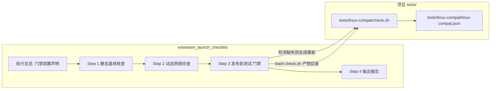

## 产品概述
更新 `extension_launch_checklist` skill 与项目测试基础设施：新增「发布前测试」步骤作为发布/上架前的硬性门禁——检测并运行 `tests/` 目录下全部测试套件，**所有套件全部通过才允许发布**，任一失败阻断并输出修复清单。首个套件为 Linux 成品兼容性测试（`tests/linux-compat/`），验证已构建成品扩展在 Linux Chromium 中的安装与使用。

## 核心功能
- **发布门禁**：Step 3「发布前测试」在发布流程中必执行；扫描 `tests/` 下全部套件（目录内存在 `check.sh` 即视为套件），逐套件运行，全部 PASS 放行，任一 FAIL 阻断
- **执行顺序（已选定）**：静态基线核查 → 网络侦查 → 发布前测试 → 输出报告；skill 开头新增「执行总览」前置声明门禁语义（先轻后重、快速失败，门禁地位不靠改变顺序突出）
- **测试用例独立落位**：脚本与断言配置存放于项目 `tests/linux-compat/`，随版本控制、CI 可复用；skill 仅承载方法论，项目缺失套件时生成模板
- **验证对象为成品**：仅验证构建产物在 Linux 的安装与使用（manifest 解析、资源完整性、SW 启动、CS 注入、内嵌平台资源），不重建产物、不涉及 bun/node 等开发工具链
- **高效流程**：首次初始化（一次性约 5~10min）后，每次测试单命令 40~60s 出结果；headless 快速路径 + WSLg 深入路径可选
- **测试用例规范入项目 rules**：新增 `.codebuddy/rules/测试用例.mdc`，固化套件目录约定、配置 schema、调用方式、发布门禁语义与平台差异检查约定
- **报告联动**：输出报告追加「发布前测试」小节（各套件结果 + 门禁结论），沿用【事实】/【推测】置信度标注


## 技术栈
- Bash 脚本（零依赖，WSL2 内直接运行，用 grep/sed 解析 JSON，不引入 jq/python）
- Markdown（SKILL.md 更新）+ .mdc 项目规则（frontmatter 格式与现有 `分发方式.mdc`/`国际化.mdc` 一致）

## 实施方法
采用「skill 方法论层 + 项目测试套件层」两层架构：



- **SKILL.md**：开头加「执行总览（发布流水线）」区声明门禁；Step 3「发布前测试」定义套件扫描与门禁判定；指引首个套件 `tests/linux-compat/`
- **tests/linux-compat/check.sh**：固化断言脚本（项目资产），阶段 0~4（产物同步/静态预检/加载验证/功能 smoke/平台专项），输出 PASS/FAIL 清单与耗时统计，退出码 0/1
- **tests/linux-compat/linux-compat.json**：项目断言配置（smoke.url、smoke.injectFlag、platform.resources[]）
- **运行时暂存区** `~/ext-test/run/`：脚本内部管理（不入版本库），规避 /mnt/c 跨盘权限位问题

## 修改目标
```
C:\Users\Mrzha\.codebuddy\skills\extension_launch_checklist\
└── SKILL.md                      # [MODIFY] 开头加「执行总览」区；插入 Step 3 发布前测试；原 Step 3 顺延 Step 4，报告追加小节

d:\code\speeding\
├── tests\
│   └── linux-compat\
│       ├── check.sh              # [NEW] 固化测试脚本（阶段 0~4、零依赖、PASS/FAIL+耗时、退出码 0/1）
│       └── linux-compat.json     # [NEW] 项目断言配置模板
└── .codebuddy\rules\
    └── 测试用例.mdc              # [NEW] 项目规则：测试用例规范 + 发布门禁语义
```

## 详细设计

### 1. SKILL.md 结构调整（最终顺序）
- **开头新增「执行总览（发布流水线）」区**：声明"发布必须依次通过 Step 1~3，Step 3 未全部通过禁止发布"
- Step 1（静态基线核查）、Step 2（动态网络侦查）保持不变
- 新增 **Step 3: 发布前测试**：
  - 门禁语义：发布/上架前必执行；扫描 `tests/` 下全部套件（存在 `check.sh` 即视为套件），逐套件 `bash tests/<suite>/check.sh <产物目录>`，全部 PASS 放行，任一 FAIL 阻断并输出修复清单
  - 首个套件指引：`tests/linux-compat/`（Linux 成品兼容性验证）——首次初始化（`sudo apt install -y chromium` + `check.sh --init` + 基线校准）、每次测试流程表（阶段 0~5 及耗时/重要性）、常见坑清单
  - 本机基线：实测值（Ubuntu 24.04.1 LTS / 内核 6.18.35.2-microsoft-standard-WSL2 / 16 核 / 15Gi / git 2.54.0 / chromium 未装）
- 原 Step 3（输出报告）顺延为 **Step 4**，报告格式追加 `#### 5. 发布前测试`（各套件结果 + 门禁结论）
- frontmatter `allowed-tools` 已含 Bash，无需修改

### 2. 固化脚本 check.sh 设计（零依赖）
- 三种模式：默认（阶段 0~4）、`--init`（初始化目录 + 生成配置模板）、`--deep`（阶段 5 WSLg 深入验证引导，可选）
- 阶段实现：
  - 阶段 0：`rsync -a --delete <产物目录>/ ~/ext-test/run/`
  - 阶段 1：manifest.json 存在且含 `manifest_version`/`name`/`version`；`_locales/`、`icons/` 必需资源存在；`stat -c %a` 权限位为 644/755，无 000/0600
  - 阶段 2：`chromium --headless=new --load-extension=~/ext-test/run --disable-extensions-except=~/ext-test/run --user-data-dir=<临时目录> --enable-logging=stderr --v=1`，从 stderr grep manifest 解析失败/SW 启动报错/icon 缺失关键字
  - 阶段 3：读取配置 smoke.url/smoke.injectFlag，`--dump-dom` 断言注入标志存在，日志无 Uncaught/ERROR；配置缺失时跳过并标注
  - 阶段 4：配置 platform.resources[] 非空时触发——`file` 查架构、`ldd` 查 GLIBC（Ubuntu 24.04 = GLIBC 2.39）、manifest 引用路径与磁盘文件名大小写核对
- 输出：PASS/FAIL 清单 + 各阶段耗时统计；退出码 0=全部通过、1=存在失败

### 3. linux-compat.json 配置模板
```json
{
  "smoke": { "url": "", "injectFlag": "" },
  "platform": { "resources": [] }
}
```

### 4. 测试用例.mdc 项目规则（新增）
- frontmatter：description / alwaysApply: true / enabled: true / updatedAt / provider（与现有 .mdc 一致）
- 正文：发布门禁语义（发布前必须全部通过）、套件目录约定（tests/<suite>/check.sh + 配置）、扩展方式（新增套件即新增目录）、配置 schema、调用方式、与 extension_launch_checklist skill 的联动、边界（不重建产物/不装 bun/node）、平台差异检查约定（GLIBC ≤ 2.39、大小写敏感、权限位）

## 执行注意
- 修改后完整通读 SKILL.md、check.sh、测试用例.mdc：Step 编号、报告小节编号、触发词前后连贯
- 脚本保持零依赖；产物路径占位符：Windows 侧 `.output` 在 WSL 中对应 `/mnt/d/code/speeding/.output`，经 `wsl -e bash -c` 执行
- 不修改既有 Step 1/2 内容与既有 rules 文件（分发方式.mdc/国际化.mdc）


## Agent Extensions
### Skill
- **skill-creator**
  - Purpose: 校验 SKILL.md 更新与 .mdc 项目规则的 frontmatter（description/alwaysApply/enabled）与 Markdown 结构符合 CodeBuddy 规范，确认新增 Step 3 与测试用例.mdc 合规
  - Expected outcome: 新增内容无格式违规，插入方案可安全写入
- **extension_launch_checklist**
  - Purpose: 本任务修改目标本身；更新后按其既有风格（中文编号步骤、检查项清单、【事实】/【推测】置信度标注）校验新增 Step 3 与现有 Step 1/2 风格一致、触发词衔接
  - Expected outcome: 新增内容与现有结构无缝衔接，skill 触发词可正常识别「发布前测试」步骤
