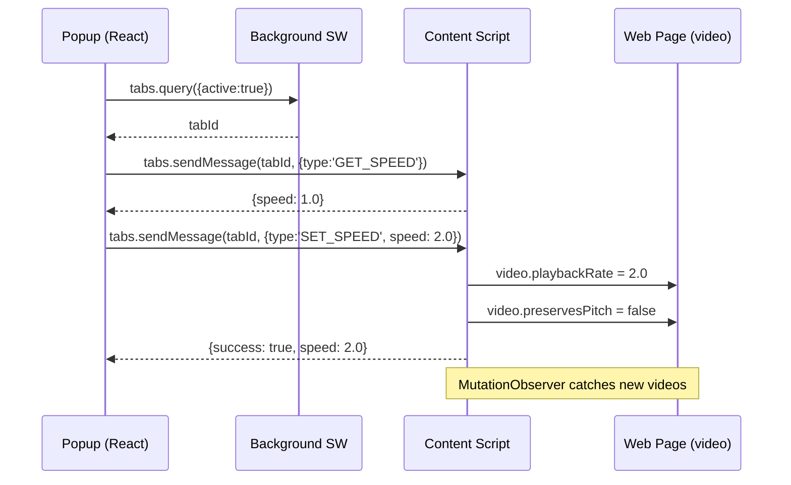

## 产品概述
一款浏览器视频变速扩展，帮助用户追剧、学习视频课程时自由控制播放速度。通过工具栏 Popup 面板快速调整 0.5x ~ 16x 倍速，同时优化音频避免失真。

## 核心功能
- **无极调速**：滑块范围 0.5x ~ 16x，步进 0.25x，拖动时实时生效
- **预设速度**：一键切换常用倍速（0.5x, 1x, 1.5x, 2x, 3x, 4x, 8x, 16x）
- **自定义输入**：支持手动输入任意速度值，精确到 0.25x
- **音频优化**：对所有视频设置 `preservesPitch = false`，避免数字音频伪影，提供更自然的听感
- **动态视频检测**：自动识别页面中后续加载的视频（如 SPA 切换、无限滚动）
- **当前速度显示**：打开 Popup 时自动查询当前页面视频播放速度


## 技术栈
- **框架**：WXT (v0.20) + React 19 + TypeScript
- **样式**：Tailwind CSS v4（通过 `@tailwindcss/vite` 插件）
- **包管理**：Bun
- **目标平台**：Chrome Manifest V3

## 实现方案

### 通信架构



### 模块划分

| 模块 | 文件 | 职责 |
|------|------|------|
| **SpeedController** | `entrypoints/utils/speed-controller.ts` | 封装视频节点管理、速度设置、MutationObserver |
| **Content Script** | `entrypoints/content.ts` | 页面注入入口，实例化 SpeedController，接收消息 |
| **Popup UI** | `entrypoints/popup/App.tsx` | 调速面板组件，滑块/预设/自定义输入 |
| **Background** | `entrypoints/background.ts` | 保持最小化，仅生命周期 |

### SpeedController 核心设计

```
class SpeedController {
  private currentSpeed: number = 1.0
  private observedVideos: Set<HTMLVideoElement>
  private observer: MutationObserver

  constructor()              // 扫描已有 video，启动 observer
  scan(): void              // 遍历 document 中所有 video，应用设置
  setSpeed(rate: number): void  // 更新所有已追踪 video 速度
  getSpeed(): number        // 返回当前速度
  private handleVideo(v: HTMLVideoElement): void  // 单 video 初始化
  destroy(): void           // 断开 observer
}
```

关键实现点：
- `handleVideo` 设置 `preservesPitch = false` 并应用当前速度
- MutationObserver 监听 `childList` + `subtree`，检测新增 video 节点
- `setSpeed` 先 clamp 到 [0.5, 16] 再应用

### 消息协议

```typescript
// Popup → Content
type SpeedMessage =
  | { type: 'GET_SPEED' }
  | { type: 'SET_SPEED'; speed: number }

// Content → Popup
type SpeedResponse =
  | { speed: number; videoCount: number }       // GET_SPEED
  | { success: boolean; speed: number }          // SET_SPEED
```

## 实现细节

### 性能考量
- MutationObserver 回调做防抖处理，避免密集 DOM 变更时重复扫描
- `observedVideos` 使用 Set 去重，防止同一 video 被重复处理
- Slider `onInput` 事件直接发送消息（实时调速），无需额外防抖

### 边界处理
- 页面无视频时，Popup 显示提示而非空白
- 速度值 clamp 到 [0.5, 16]，非法输入自动修正
- `tabs.sendMessage` 失败时静默捕获（用户可能切换了标签页）
- 动态添加的 video 自动继承当前全局速度

### 日志
- 复用 `console.log`，仅在 dev 模式输出关键事件（video found, speed change）
- 不在生产代码中保留敏感信息

## 目录结构

```
d:/code/speeding/
├── entrypoints/
│   ├── background.ts                          # [KEEP] 最小化，仅生命周期日志
│   ├── content.ts                             # [MODIFY] 完整 Content Script：实例化 SpeedController + 消息监听
│   ├── utils/
│   │   └── speed-controller.ts                # [NEW] SpeedController 类：video 管理 + MutationObserver + preservesPitch
│   └── popup/
│       ├── App.tsx                            # [MODIFY] 调速面板：速度显示 + 滑块 + 预设按钮 + 自定义输入
│       ├── App.css                            # [DELETE] 模板样式文件，改用 Tailwind
│       ├── index.html                         # [MODIFY] 更新 title 为 "Speeding"
│       ├── main.tsx                           # [MODIFY] 移除 App.css 导入行
│       └── style.css                          # [MODIFY] 精简为基础重置样式（body margin, font-family）
├── assets/
│   └── react.svg                              # [DELETE] 模板资源
├── wxt.config.ts                              # [MODIFY] 添加 manifest name/description
└── package.json                               # [MODIFY] 更新 name/description
```

## 关键代码结构

### SpeedController 接口定义

```typescript
interface SpeedController {
  setSpeed(rate: number): void;
  getSpeed(): number;
  getVideoCount(): number;
  destroy(): void;
}

interface SpeedMessage {
  type: 'GET_SPEED' | 'SET_SPEED';
  speed?: number;
}

interface SpeedResponse {
  speed: number;
  videoCount: number;
  success?: boolean;
}
```


## 设计风格
采用现代深色 Glassmorphism 风格，Control Center 式的紧凑控制面板。Popup 固定宽度 320px，深色渐变背景配合毛玻璃卡片，明亮的蓝紫渐变作为强调色。

## 布局结构（从上到下）
- **标题栏**：扩展名称 "Speeding"，右上角显示当前速度徽章（大号数字）
- **滑块区域**：全宽 range slider，左右标注 0.5x / 16x，刻度感清晰；拖动时滑块轨道高亮显示已选范围
- **预设按钮网格**：2 行 x 4 列 grid，8 个常用倍速按钮（0.5 / 1 / 1.5 / 2 / 3 / 4 / 8 / 16），当前选中按钮高亮填充
- **底部自定义输入**：数字输入框 + "Apply" 按钮，输入框限制 0.5-16 范围

## 交互细节
- Slider 拖动实时发送调速指令，松手时无需额外确认
- 预设按钮点击后立即高亮，同时更新滑块位置
- 自定义输入失焦或按 Enter 自动应用，输入非法值自动修正
- 页面无视频时显示居中提示："No video detected on this page"
- 所有交互有 hover 态微动效（按钮缩放、颜色过渡）
