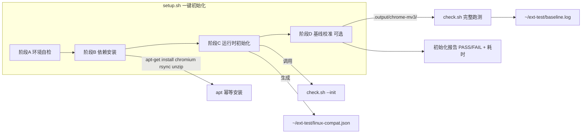

## 产品概述
规划 WSL2 环境初始化方案，支撑 Linux 成品兼容性测试（`tests/linux-compat/check.sh`）的首次初始化，将 SKILL.md 中手动 4 步初始化升级为脚本化一键初始化。

## 核心功能
- **一键初始化脚本** `tests/linux-compat/setup.sh`：阶段 A 环境自检 → 阶段 B 依赖安装 → 阶段 C 运行时初始化 → 阶段 D 基线校准，幂等可重跑，零依赖 bash，输出各阶段 PASS/FAIL 与总耗时
- **环境自检**：发行版/内核/内存/磁盘 + WSLg 可用性（`/mnt/wslg` 存在性判定）
- **依赖安装**：幂等安装 chromium + rsync + unzip（已装则跳过；`sudo apt-get` 交互输密码一次）
- **运行时初始化**：复用 `check.sh --init` 生成 `~/ext-test/` 与配置模板，检测配置是否待填写
- **基线校准**（可选）：用 `.output/chrome-mv3/` 实跑完整 check.sh，结果存档 `~/ext-test/baseline.log` 作对照
- **文档联动**：SKILL.md Step 3.1「首次初始化」改为引导 setup.sh；测试用例.mdc 补充 setup.sh 调用约定
- **执行验证**：实跑 setup.sh 完成本机初始化（含 apt 安装 chromium）并校准验证


## 技术栈
- Bash 脚本（零依赖，WSL2 内直接运行；沿用 check.sh 的 grep/sed 风格，不引入 jq/python）
- Markdown（SKILL.md 更新）+ .mdc 项目规则（沿用现有 frontmatter 格式）

## 实施方法
沿用「skill 方法论层 + 项目测试套件层」两层架构，初始化能力以项目测试套件资产承载：



- **setup.sh 阶段设计**：
  - 阶段 A：探测 `/etc/os-release`、`uname -r`、内存/磁盘；WSLg 判定用 `/mnt/wslg` 存在性（DISPLAY 在非交互 shell 常为空，不作硬性条件）
  - 阶段 B：`DEBIAN_FRONTEND=noninteractive sudo apt-get update` + `apt-get install -y chromium rsync unzip`；逐项 `dpkg -s` 幂等跳过；sudo 失败（非交互无密码）时明确报错提示在交互终端执行
  - 阶段 C：调用 `check.sh --init`；用 grep 检查生成配置中 `smoke.url`/`smoke.injectFlag` 是否为空，为空则提示填写路径与样例
  - 阶段 D（默认执行、`--skip-baseline` 跳过）：以 `.output/chrome-mv3/` 为产物跑 `check.sh`，输出 tee 到 `~/ext-test/baseline.log`，记录基线结果
  - 汇总：各阶段 PASS/FAIL 计数 + 总耗时 + 后续使用命令提示（含 `--deep` 与 WSLg 说明）
- **SKILL.md Step 3.1 修改**：首次初始化 4 步压缩为「运行 `bash tests/linux-compat/setup.sh` 一键完成（自检+安装+运行时初始化+基线校准）」，保留配置填写说明与校准对照提示
- **测试用例.mdc 修改**：调用方式小节补充 setup.sh（首次初始化入口、幂等可重跑、依赖清单 chromium/rsync/unzip、sudo 密码交互说明、基线校准存档位置）

## 修改目标
```
d:\code\speeding\
├── tests\linux-compat\
│   ├── setup.sh                # [NEW] 环境初始化脚本（阶段 A~D、幂等、PASS/FAIL+耗时、退出码 0/1）
│   ├── check.sh                # [已有] 不变（setup.sh 内部调用其 --init）
│   └── linux-compat.json       # [已有] 不变
C:\Users\Mrzha\.codebuddy\skills\extension_launch_checklist\SKILL.md
                                # [MODIFY] Step 3.1 首次初始化改为引导 setup.sh
d:\code\speeding\.codebuddy\rules\测试用例.mdc
                                # [MODIFY] 调用方式小节补充 setup.sh 约定
```

## 详细设计
### 1. setup.sh（零依赖 bash）
- 用法：`bash tests/linux-compat/setup.sh [--skip-baseline]`；`set -uo pipefail`
- 阶段 A：输出 Ubuntu 24.04.1 / 内核 6.18.35.2 / 16核 / 15Gi；`/mnt/wslg` 存在 → WSLg ✅（提示深入验证需交互 shell 确认 DISPLAY）；磁盘 < 5G 可用则警告
- 阶段 B：`sudo -v` 探测可交互；`dpkg -s chromium` 已装则跳过；否则 `DEBIAN_FRONTEND=noninteractive sudo apt-get update -qq` + `install -y`；rsync/unzip 同理；任一安装失败 FAIL 并列出修复命令
- 阶段 C：`bash "$SCRIPT_DIR/check.sh" --init`；检查 `~/ext-test/linux-compat.json` 中 `smoke.url`/`smoke.injectFlag` 空值并提示填写格式
- 阶段 D：默认用 `$(dirname SCRIPT_DIR)/../.output/chrome-mv3`（项目相对路径解析）跑 `check.sh`，tee 存档；产物目录不存在则 SKIP 并提示
- 汇总：PASS/FAIL 统计、总耗时、`bash tests/linux-compat/check.sh <产物>` 与 `--deep` 提示；FAIL>0 退出码 1
- 校验：WSL 内 `bash -n` + 实跑验证

### 2. SKILL.md Step 3.1 修改
- 首次初始化改为：`bash tests/linux-compat/setup.sh`（自检→装 chromium/rsync/unzip→生成 ~/ext-test/→基线校准存 baseline.log）；随后填写 `linux-compat.json` 的 smoke 配置；说明 sudo 需交互输密码一次
- 删除原手动 4 步中的安装命令与 `--init` 调用，其余说明（配置字段、基线对照）保留

### 3. 测试用例.mdc 修改
- 调用方式小节新增：首次初始化入口 `bash tests/linux-compat/setup.sh`（幂等可重跑，`--skip-baseline` 可跳过校准）；依赖清单与 sudo 密码说明；基线存档 `~/ext-test/baseline.log`

## 执行注意
- 不修改 check.sh 阶段逻辑与 linux-compat.json；不修改既有 Step 1/2 与既有 rules 文件
- setup.sh 保持零依赖；WSLg 判定以 /mnt/wslg 存在性为准
- 实跑验证需 sudo 密码（apt install chromium 约 2~5min），在交互终端/授权环境下执行；验证后确认 .output/chrome-mv3/ 校准结果


## Agent Extensions
### Skill
- **extension_launch_checklist**
  - Purpose: 本任务修改目标之一；更新后按其既有风格（中文编号步骤、✅/❌/⚠️ 判定、【事实】/【推测】标注）复核 Step 3.1 首次初始化改写与 Step 3 其余内容风格一致、触发词衔接
  - Expected outcome: Step 3.1 引导 setup.sh 的写法与现有结构无缝衔接，无编号/格式破坏
